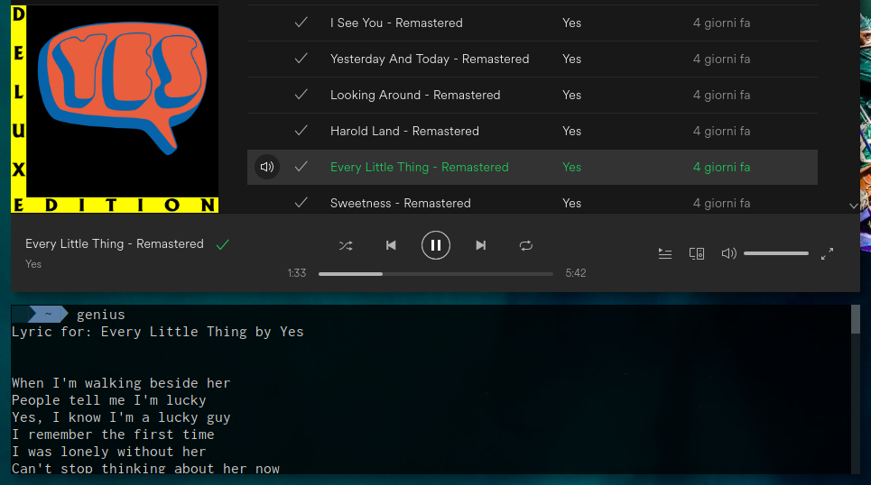

# Genius

Find the lyrics of the song you are listening to directly from your Linux terminal. Lyrics are from [Genius](https://genius.com/)

## Requirements

- Python 3
- [BeautifulSoup](https://www.crummy.com/software/BeautifulSoup/)

### Optional

- [argcomplete](https://argcomplete.readthedocs.io/en/latest/) with [active global completion](https://pypi.org/project/argcomplete/#activating-global-completion): tab completion of arguments

## How to use

    git clone https://github.com/golim/genius
    cd genius
    chmod +x genius-lyrics

Set an environment variable called `GENIUS_TOKEN` with the token you can request [here](https://genius.com/api-clients) and reboot.

    ./genius-lyrics

### How to Install

Using `pip`:

    pip install genius-lyrics

From cloned source code:

    sudo cp genius-lyrics /usr/local/bin/genius-lyrics

## Screenshot

## Warning

Due to the stupid search function of genius it may happen that the script finds the wrong song.
